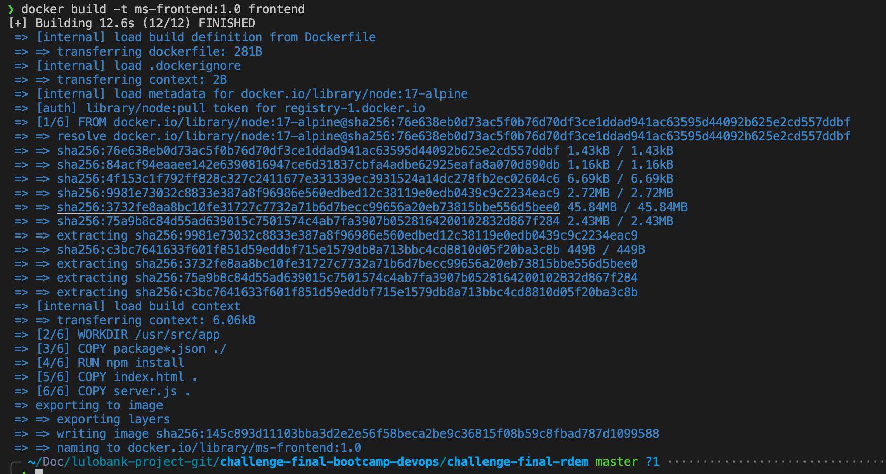
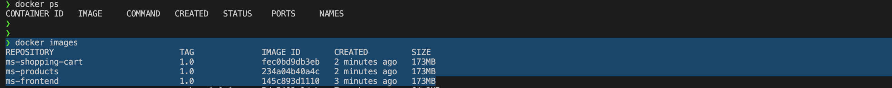
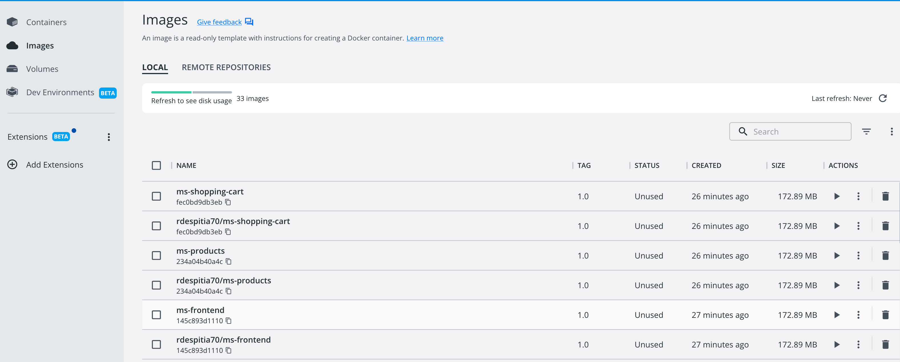
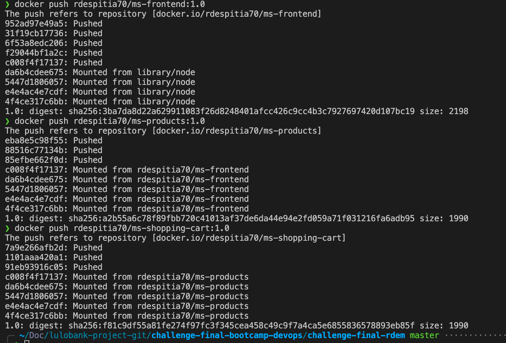
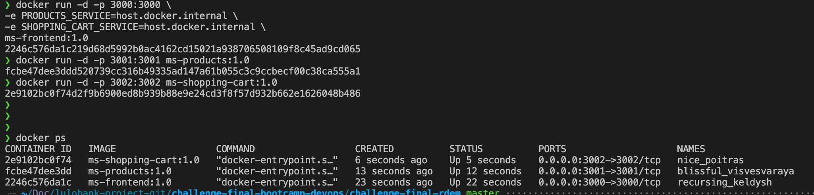
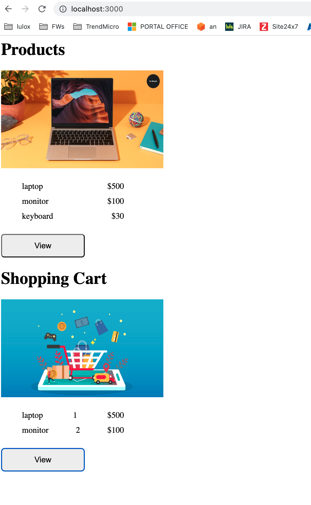
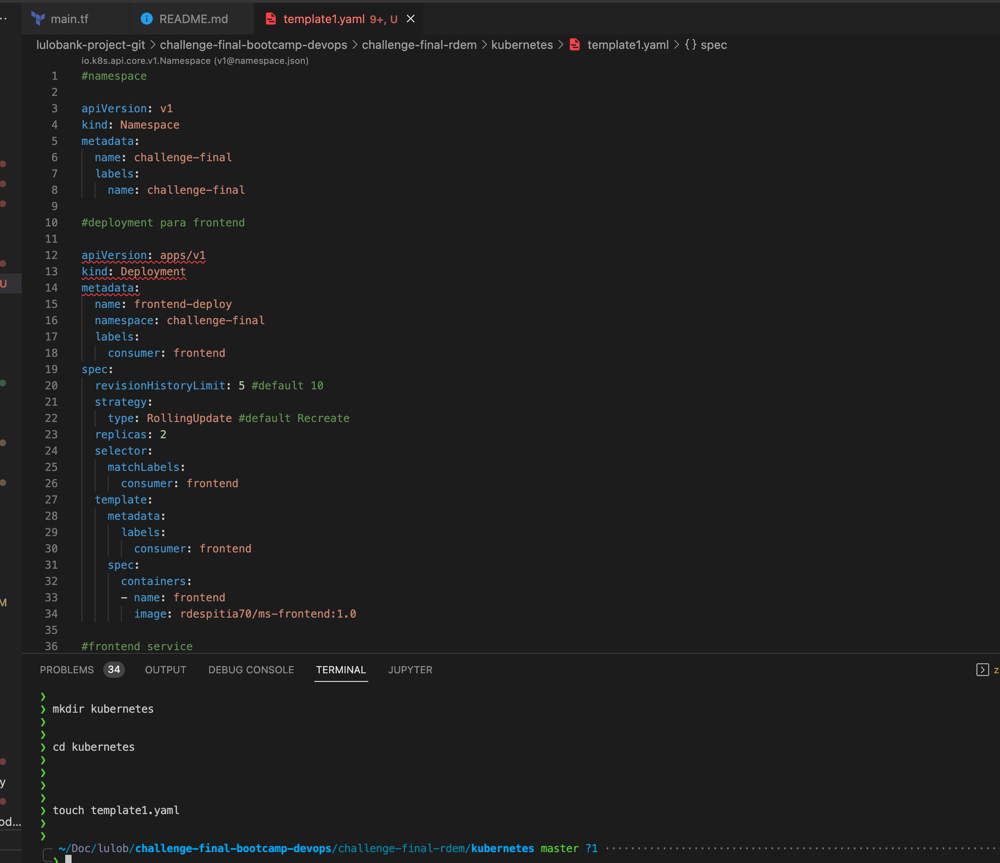

# challenge-final-bootcamp-devops

1. Inicialmente ejecutamos todo en local para validar que todo funcione, para posterior continuar con los otros

Construyendo imagenes:


Imagenes construidas:


Subida de imagenes a dockerhub


Docker push:


Historial de los comandos ejecutados:
```
 5968  docker tag ms-frontend:1.0 rdespitia70/ms-frontend:1.0
 5969  docker tag ms-products:1.0 rdespitia70/ms-products:1.0
 5970  docker tag ms-shopping-cart:1.0 rdespitia70/ms-shopping-cart:1.0
 5978  docker push rdespitia70/ms-frontend:1.0
 5979  docker push rdespitia70/ms-products:1.0
 5980  docker push rdespitia70/ms-shopping-cart:1.0
```

Lanzamos ahora el docker run y hacemos pruebas:
Docker run:


Pruebas:


2. Construccion de kubernetes template

template1.yaml


```
kubectl apply -f template1.yaml
```